# 灵眸

<<<<<<< HEAD

### INTRODUCTION

**See the world together**
“灵眸”利用人工智能技术，让视障人士和低视力与我们一起“看见世界”

### 主要功能
- 视障患者端
  - 智能“读屏”
    - 物体识别模式：识别镜头物体并播报
    - 文本识别模式：提取文本并朗读
    - 场景感知模式：描述相机画面
  - 求助功能
    - 快速地向紧急联系人拨打电话求助
- 志愿者端
  - 浏览视障患者相关资讯
  - 注册成为志愿者，为视障患者提供帮助

### 页面设计
- 患者端
  - 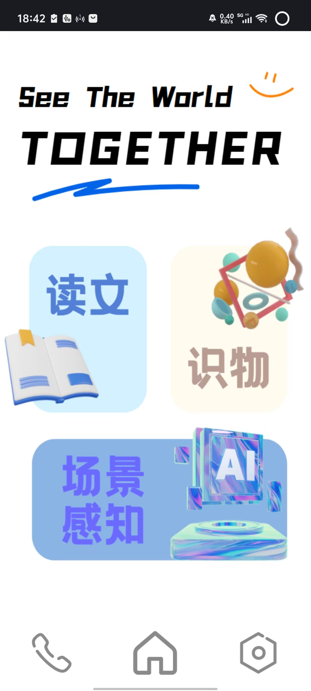
  - 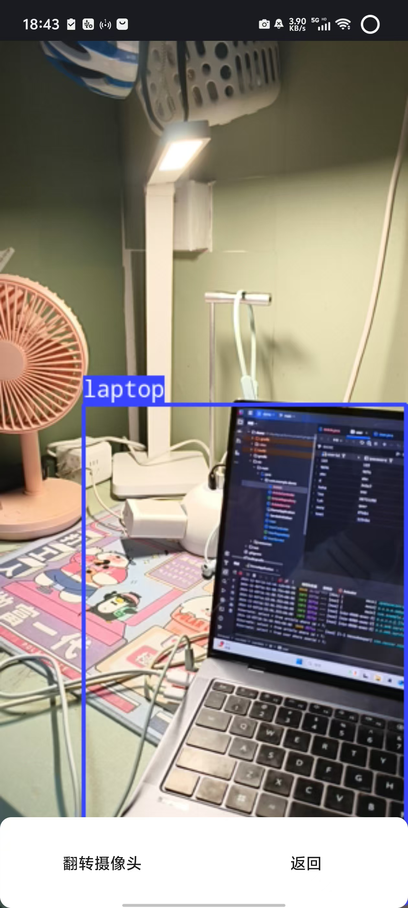
  - 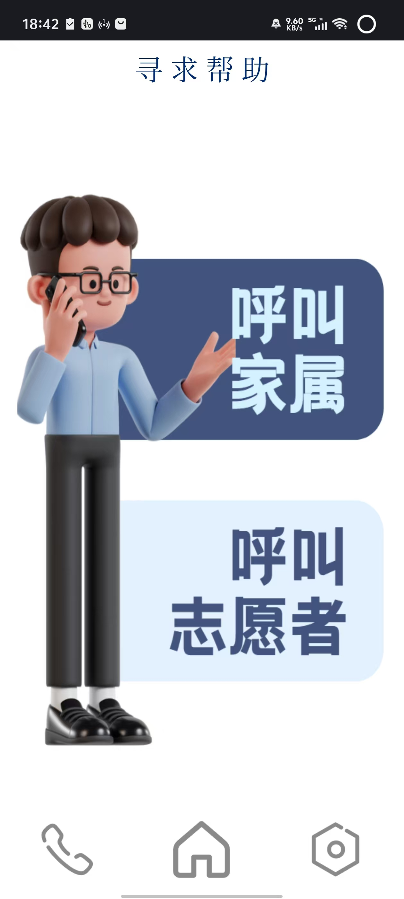
- 志愿者端
  - 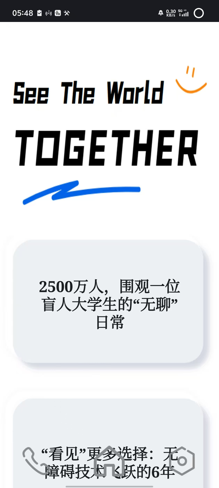
  - 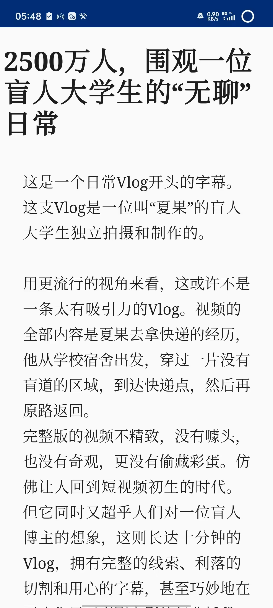
  - 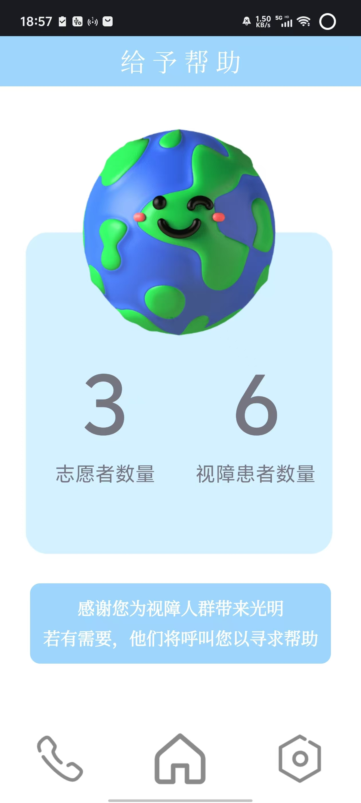
- 常规功能
  - 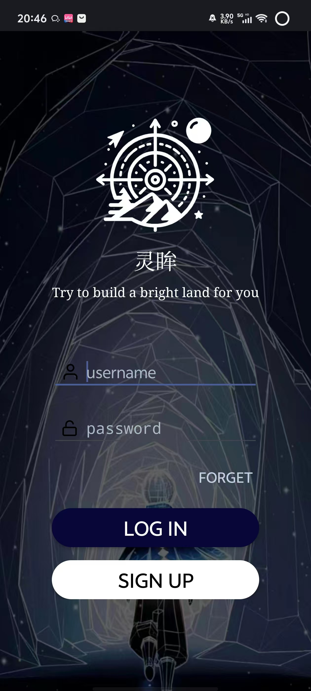
  - 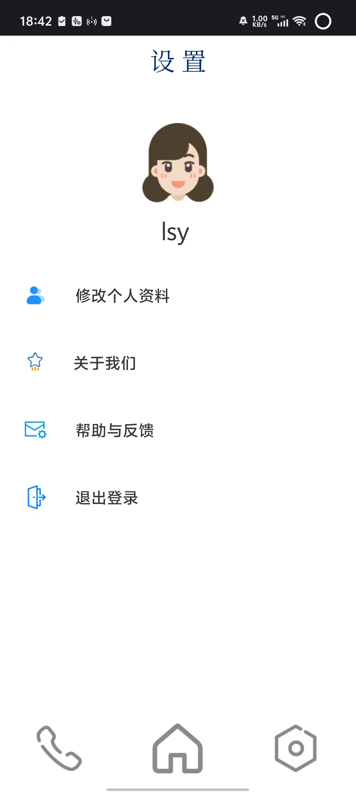
  - 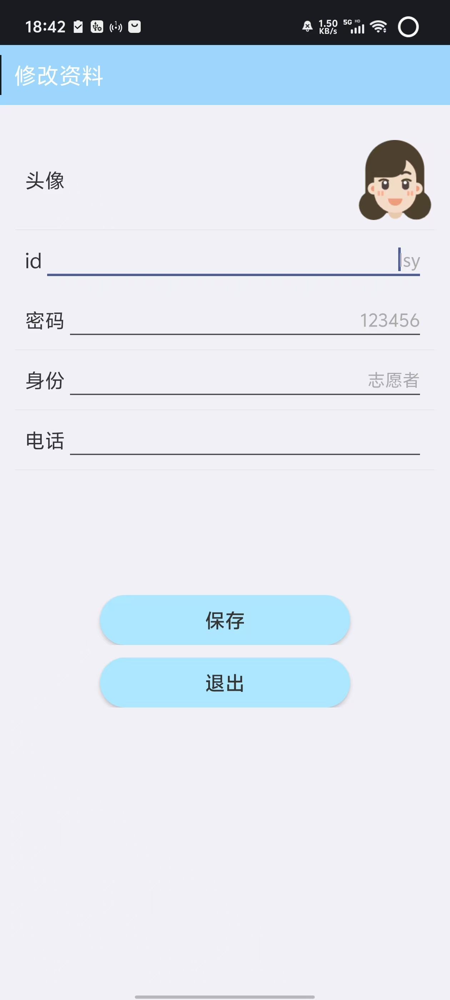
  - 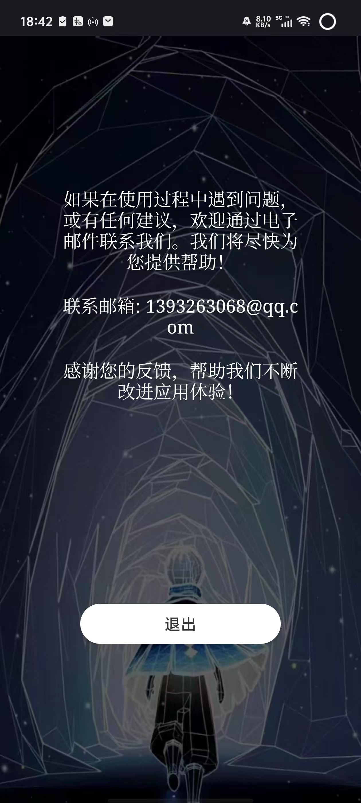
  - 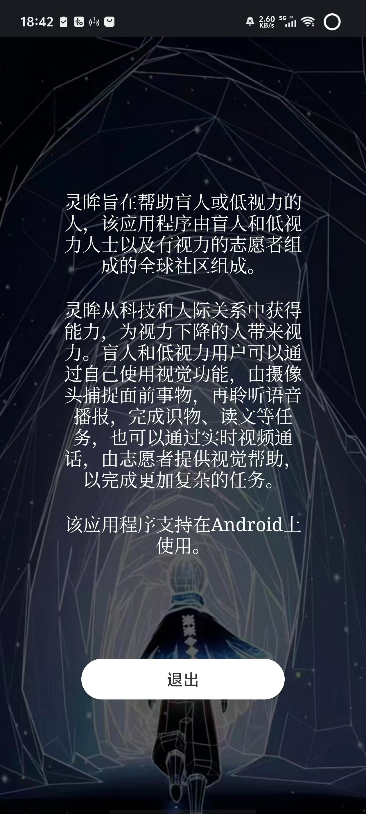

